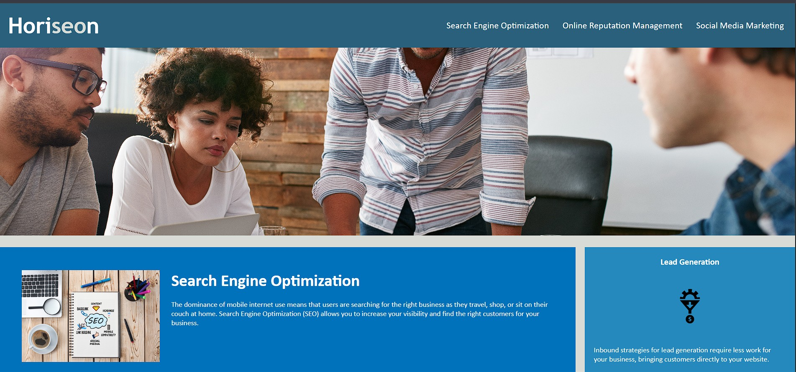

# Horiseon - Digital Marketing Services

_A student project that is a simple, responsive webpage for Horiseon, a digital marketing services company. Highlighting the company's services, benefits, and branding in a clean and visually appealing layout._

## Media

### Live Demo

 [SEO Horiseon](https://heimsharon.github.io/SEO-HTML/#social-media-marketing)

### Screenshot

## Table of Contents

- [Horiseon - Digital Marketing Services](#horiseon---digital-marketing-services)
  - [Media](#media)
    - [Live Demo](#live-demo)
    - [Screenshot](#screenshot)
  - [Table of Contents](#table-of-contents)
  - [Description](#description)
  - [Features](#features)
  - [Technologies Used](#technologies-used)
  - [File Structure](#file-structure)
  - [How to View](#how-to-view)
  - [License](#license)
  - [Acknowledgments](#acknowledgments)

## Description

The webpage provides information about Horiseon's services, including:

- Search Engine Optimization (SEO)
- Online Reputation Management
- Social Media Marketing

All of which highlights the benefits of these services, such as lead generation, brand awareness, and cost management.

## Features

- **Responsive Design**: The webpage is styled to look great on all devices.
- **Hero Section**: A large, visually appealing image below the header.
- **Service Sections**: Detailed descriptions of the company's services.
- **Benefits Panel**: A sidebar showcasing the benefits of the services.
- **Footer**: A footer with branding and copyright information.

## Technologies Used

- **HTML5**: For the structure of the webpage.
- **CSS3**: For styling and layout.

## File Structure

- **`index.html`**: The main HTML file for the webpage.
- **`assets/css/style.css`**: The CSS file for styling the webpage.
- **`assets/images/digital-marketing-meeting.jpg`**: The hero image used in the webpage.
- **`assets/images/SEO-HTML-Live.jpg`**: screenshot of website.

## How to View

1. Clone or download the repository.
2. Open `index.html` in any modern web browser.

## License

This project is licensed under the MIT License. See the LICENSE file for details.

## Acknowledgments

Portions of this project were developed using starter code provided by [edX Boot Camps LLC](https://bootcamp.edx.org/) for educational purposes.
